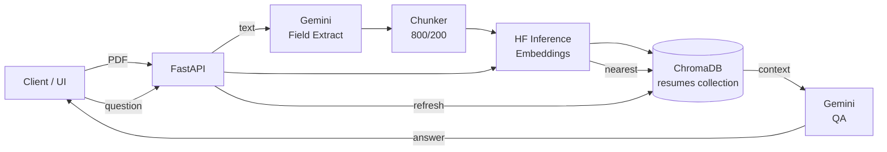
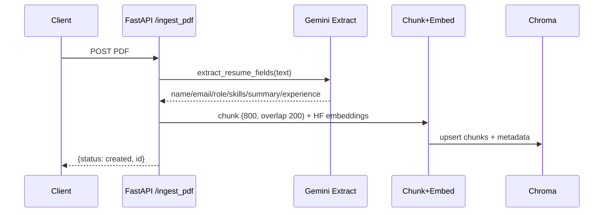
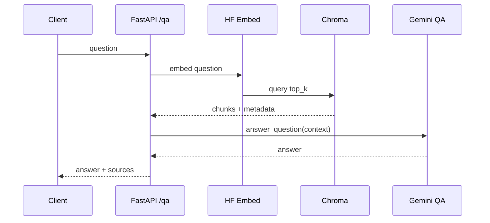
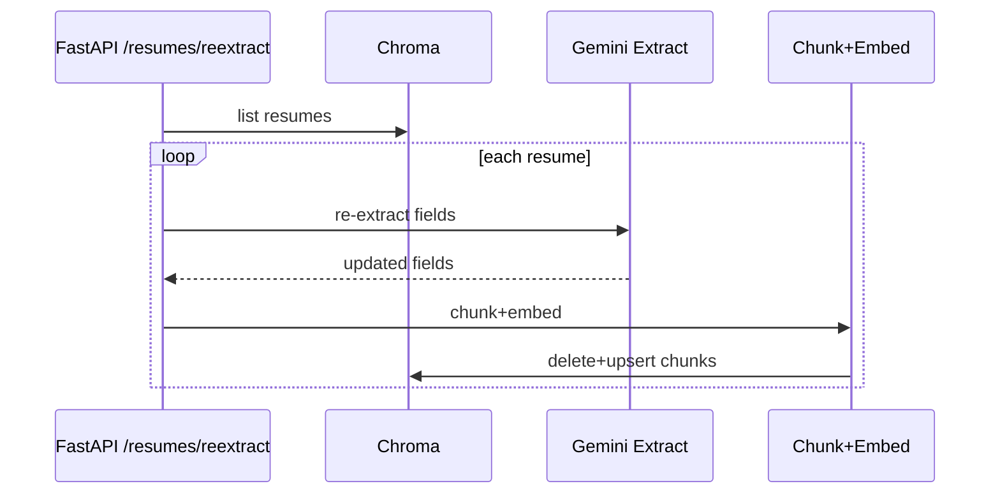

<div align="center">

# mcp-resume-engine

FastAPI + LangGraph RAG backend for PDF resumes. Ingests resumes from PDFs, auto-extracts fields with Gemini, chunks and embeds with Hugging Face Inference, stores vectors in Chroma, and answers questions over the corpus.

</div>

## Architecture



### Ingest flow


### QA flow


### Refresh flow


## Capabilities
- PDF-only ingest; Gemini extracts fields so no manual metadata entry.
- ChromaDB persistence (`chroma_storage/`) keeps embeddings across restarts.
- Hugging Face Inference for lightweight, remote embeddings (no local weights).
- LangGraph orchestrates ingest and refresh for repeatable flows.
- Rule-based QA fallback if Gemini declines or returns empty.

## Requirements
- Python 3.11+
- Hugging Face Inference token (for embeddings)
- Gemini API key (for field extraction + QA)

## Environment variables
Place in `.env` (loaded automatically):

```
GEMINI_API_KEY=your_gemini_key
HUGGINGFACE_API_TOKEN=your_hf_token
# Optional overrides
GEMINI_MODEL_NAME=gemini-2.5-flash
ALLOWED_ORIGINS=http://localhost:3000,http://127.0.0.1:3000
```

## Quickstart (local)
```bash
python -m venv .venv
source .venv/Scripts/activate  # Windows PowerShell: .\.venv\Scripts\Activate.ps1
pip install -r requirements.txt
uvicorn backend.main:app --reload
```
- Swagger UI: http://127.0.0.1:8000/docs
- Health: GET /health

## API usage
- `POST /ingest_pdf` (multipart/form-data, field `file` = PDF)

	```bash
	curl -X POST "http://127.0.0.1:8000/ingest_pdf" \
		-H "Content-Type: multipart/form-data" \
		-F "file=@/path/to/resume.pdf" \
		| jq
	```

- `GET /resumes`
- `DELETE /resumes/{resume_id}`
- `POST /resumes/reextract` (re-run Gemini extract + chunk + embed for all stored resumes)
- `POST /qa`

	```bash
	curl -X POST "http://127.0.0.1:8000/qa" \
		-H "Content-Type: application/json" \
		-d '{"question":"Who has React and GraphQL experience?","top_k":3}' \
		| jq
	```

Response example:

```json
{
	"answer": "Alice (Frontend Engineer) fits best with React and GraphQL experience.",
	"sources": [
		{"id": "...", "name": "Alice", "role": "Frontend Engineer", "skills": ["react", "graphql"], "summary": "..."}
	]
}
```

## Data and storage
- Chroma persistent path: `./chroma_storage` (volume-mount in Docker if you need durability).
- Collection: `resumes`; each chunk stored with metadata (id, name, email, role, skills, summary, experience, chunk_index).
- Chunking: size 800, overlap 200 over combined fields (name/email/role/skills/experience/summary).

## Run with Docker
```bash
docker build -t mcp-resume-engine .
docker run -p 8000:8000 --env-file .env -v "${PWD}/chroma_storage:/app/chroma_storage" mcp-resume-engine
```

## Deploy to Azure Container Apps (example)
```bash
RESOURCE_GROUP=mcp-resume-rg
ENV_NAME=mcp-resume-env
APP_NAME=mcp-resume-api
IMAGE=mcpresumeacr8630.azurecr.io/mcp-resume-engine:latest  # replace with yours

az group create --name $RESOURCE_GROUP --location southeastasia
az containerapp env create --name $ENV_NAME --resource-group $RESOURCE_GROUP --location southeastasia
az containerapp secret set -n $APP_NAME -g $RESOURCE_GROUP --secrets gemini-key=$GEMINI_API_KEY hf-token=$HUGGINGFACE_API_TOKEN
az containerapp update -n $APP_NAME -g $RESOURCE_GROUP --set-env-vars \
	GEMINI_API_KEY=secretref:gemini-key \
	HUGGINGFACE_API_TOKEN=secretref:hf-token \
	GEMINI_MODEL_NAME=gemini-2.5-flash \
	ALLOWED_ORIGINS="*"
```

## Troubleshooting
- Missing `GEMINI_API_KEY` or `HUGGINGFACE_API_TOKEN` → startup will fail; set in `.env` or container secrets.
- Hugging Face 401/403 → token lacks Inference API access; use a token with `read`/`inference` scope.
- Gemini empty response → QA falls back to rule-based top-match answer; check model quota and logs.
- No resumes stored → `/qa` returns 404; ingest a PDF first.
