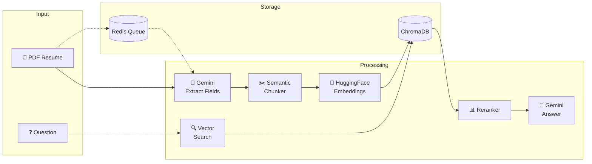
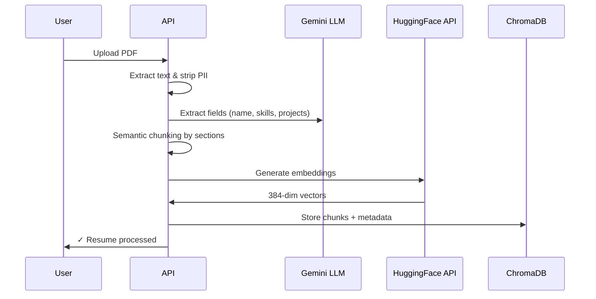
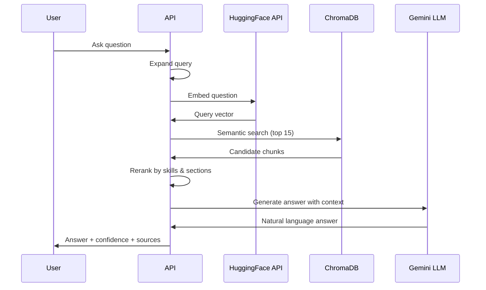

# 📄 Resume RAG Engine

> **Smart resume search powered by AI** - Upload PDFs, ask questions, get intelligent answers with source citations.

[](https://www.python.org/downloads/)
[](https://fastapi.tiangolo.com/)
[](https://www.docker.com/)

## 🎯 Overview

A production-ready Resume Discovery API that uses semantic search and LLM-powered question answering to find and analyze resumes. Built with privacy-first design including PII redaction and anonymous IDs.



## ✨ Features

- **🔍 Semantic Search** - Find resumes by meaning, not just keywords
- **🤖 AI-Powered Q&A** - Ask natural language questions about candidates
- **📄 PDF Processing** - Extract text and metadata from resumes
- **🔒 Privacy-First** - PII redaction and anonymous candidate IDs
- **⚡ Async Processing** - Optional Redis queue for bulk uploads
- **🎯 Multi-hop Retrieval** - Complex query decomposition for better answers
- **📊 Confidence Scores** - Know how reliable each answer is

## 🚀 Quick Start

### Option 1: Docker (Recommended)

```bash
# 1. Clone the repository
git clone https://github.com/your-repo/mcp-resume-engine.git
cd mcp-resume-engine

# 2. Create .env file
echo "GEMINI_API_KEY=your_gemini_key" > .env
echo "HUGGINGFACE_API_TOKEN=your_hf_token" >> .env

# 3. Start with Docker Compose
docker-compose up --build

# 4. Open API docs
# http://localhost:8000/docs
```

### Option 2: Local Development

```bash
# 1. Create virtual environment
python -m venv .venv
.venv\Scripts\activate  # Windows
source .venv/bin/activate  # Linux/Mac

# 2. Install dependencies
pip install -r requirements.txt

# 3. Set environment variables
export GEMINI_API_KEY=your_key
export HUGGINGFACE_API_TOKEN=your_token

# 4. Run the server
uvicorn backend.main:app --reload --host 0.0.0.0 --port 8000
```

## 📁 Project Structure

```
mcp-resume-engine/
├── backend/
│   ├── core/              # Text processing & semantic chunking
│   │   ├── chunker.py     # Section-aware resume chunking
│   │   └── preprocessor.py # Text cleaning & normalization
│   ├── embeddings/        # Vector embeddings & storage
│   │   ├── embedder.py    # HuggingFace API embeddings
│   │   └── vectorstore.py # ChromaDB vector store
│   ├── retrieval/         # Search & reranking
│   │   ├── reranker.py    # Result reranking with skill matching
│   │   ├── multihop.py    # Multi-hop retrieval for complex queries
│   │   └── verifier.py    # Confidence scoring
│   ├── queue/             # Redis queue infrastructure
│   │   ├── worker.py      # Background job processor
│   │   └── jobs.py        # Job definitions
│   ├── main.py            # FastAPI endpoints
│   ├── llm.py             # Gemini LLM integration
│   ├── models.py          # Pydantic data models
│   └── anonymizer.py      # PII redaction
├── docker-compose.yml     # Docker orchestration
├── Dockerfile             # Container build
├── requirements.txt       # Python dependencies
└── README.md
```

## 🔌 API Endpoints

| Method | Endpoint | Description |
|--------|----------|-------------|
| `POST` | `/ingest_pdf` | Upload and process a resume PDF |
| `POST` | `/qa` | Ask questions about resumes |
| `GET` | `/health` | Health check with queue status |
| `GET` | `/resumes` | List all processed resumes |
| `DELETE` | `/resumes/{id}` | Delete a resume |

### Upload Resume

```bash
curl -X POST "http://localhost:8000/ingest_pdf" \
  -F "file=@resume.pdf"
```

**Response:**
```json
{
  "status": "processed",
  "id": "abc123",
  "name": "John Doe",
  "skills": ["Python", "React", "AWS"],
  "chunk_count": 8
}
```

### Ask Question

```bash
curl -X POST "http://localhost:8000/qa" \
  -H "Content-Type: application/json" \
  -d '{"question": "Who has Python and machine learning experience?", "top_k": 5}'
```

**Response:**
```json
{
  "answer": "John Doe has extensive Python and ML experience...",
  "confidence_score": 0.92,
  "sources": [...],
  "is_fallback": false
}
```

### Async Upload (Bulk Processing)

```bash
curl -X POST "http://localhost:8000/ingest_pdf?async_mode=true" \
  -F "file=@resume.pdf"
```

Returns `job_id` for status checking.

## ⚙️ Architecture

### Ingestion Pipeline



### Question Answering Pipeline



## 🐳 Docker Compose Services

```yaml
services:
  api:        # FastAPI server (port 8000)
  redis:      # Job queue (port 6379)
  worker:     # Background processors (5 replicas)
```

**Scaling workers:**
```bash
docker-compose up --scale worker=10
```

## 🔧 Environment Variables

| Variable | Required | Description |
|----------|----------|-------------|
| `GEMINI_API_KEY` | ✅ | Google Gemini API key for LLM |
| `HUGGINGFACE_API_TOKEN` | ✅ | HuggingFace API token for embeddings |
| `ALLOWED_ORIGINS` | ❌ | CORS origins (default: `*`) |
| `REDIS_URL` | ❌ | Redis connection URL (auto-configured in Docker) |

## 📊 Tech Stack

| Component | Technology |
|-----------|------------|
| **API Framework** | FastAPI + Pydantic |
| **LLM** | Google Gemini 2.5 Flash |
| **Embeddings** | HuggingFace Inference API (MiniLM-L6-v2) |
| **Vector Store** | ChromaDB |
| **Queue** | Redis + RQ |
| **Container** | Docker + Docker Compose |

## 🔒 Privacy Features

- **PII Redaction**: Phone numbers, emails, addresses automatically masked
- **Anonymous IDs**: Hash-based candidate identifiers
- **No Raw Storage**: Original PDFs are not stored, only processed text

## 📝 License

MIT
