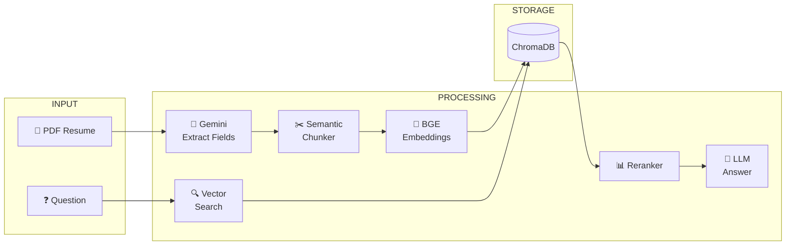
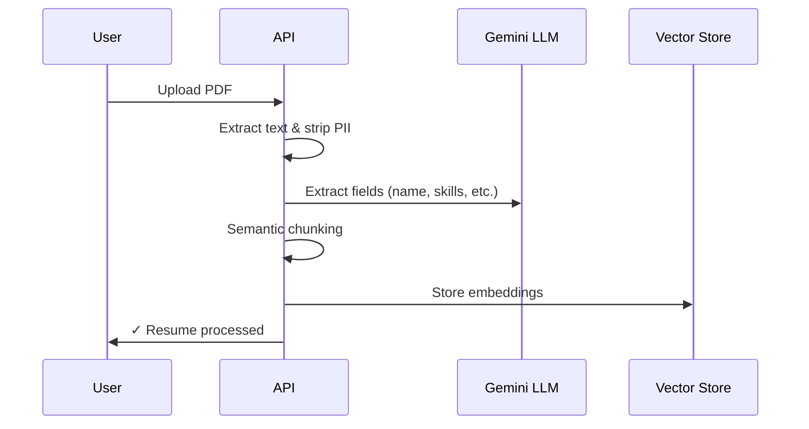
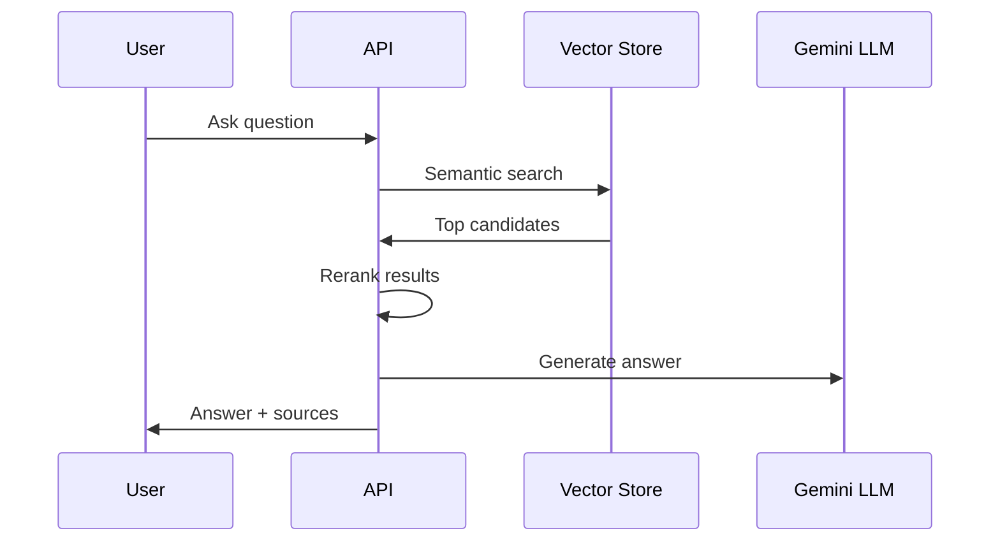
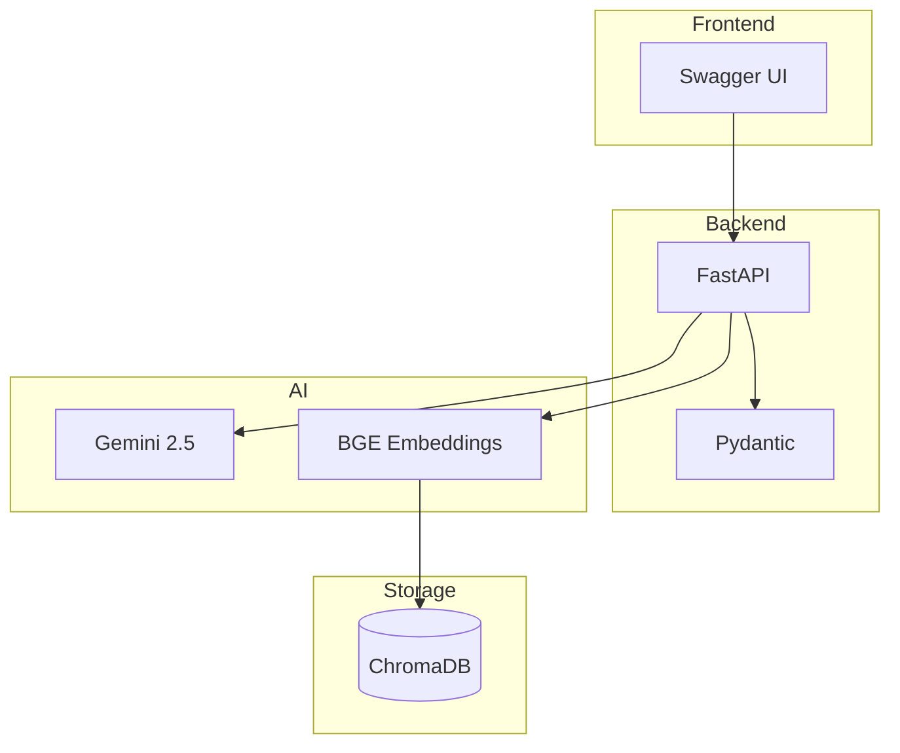

# 📄 Resume RAG Engine

> **Smart resume search powered by AI** - Upload PDFs, ask questions, get answers.

## 🎯 What it Does



## 🚀 Quick Start

```bash
# 1. Clone and setup
git clone <repo>
cd mcp-resume-engine

# 2. Create .env file
echo "GEMINI_API_KEY=your_key" > .env
echo "HUGGINGFACE_API_TOKEN=your_token" >> .env

# 3. Install and run
pip install -r requirements.txt
uvicorn backend.main:app --reload

# 4. Open browser
# http://127.0.0.1:8000/docs
```

## 📁 Project Structure

```
├── backend/
│   ├── core/           # Text processing & chunking
│   ├── embeddings/     # Vector embeddings & storage
│   ├── retrieval/      # Search & reranking
│   ├── main.py         # FastAPI endpoints
│   ├── llm.py          # Gemini integration
│   └── models.py       # Data models
├── requirements.txt
└── Dockerfile
```

## 🔌 API Endpoints

| Method | Endpoint | Description |
|--------|----------|-------------|
| `POST` | `/ingest_pdf` | Upload resume PDF |
| `GET` | `/resumes` | List all resumes |
| `DELETE` | `/resumes/{id}` | Delete a resume |
| `POST` | `/qa` | Ask questions |
| `GET` | `/health` | Health check |

### Example: Upload Resume

```bash
curl -X POST "http://localhost:8000/ingest_pdf" \
  -F "file=@resume.pdf"
```

### Example: Ask Question

```bash
curl -X POST "http://localhost:8000/qa" \
  -H "Content-Type: application/json" \
  -d '{"question": "Who knows React?", "top_k": 5}'
```

## ⚙️ How It Works

### Ingestion Pipeline



### Question Answering



## 🐳 Docker

```bash
# Build
docker build -t resume-engine .

# Run
docker run -p 8000:8000 --env-file .env resume-engine
```

## 🔧 Environment Variables

| Variable | Required | Description |
|----------|----------|-------------|
| `GEMINI_API_KEY` | ✅ | Google Gemini API key |
| `HUGGINGFACE_API_TOKEN` | ✅ | HuggingFace API token |
| `ALLOWED_ORIGINS` | ❌ | CORS origins (comma-separated) |

## 📊 Tech Stack



## 📝 License

MIT
